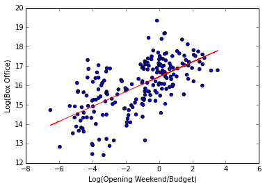
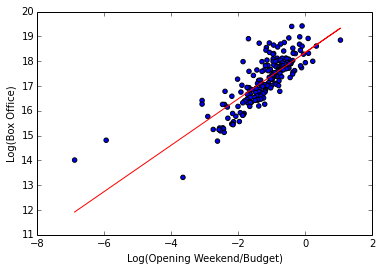

I was looking at the effect that opening weekend gross to budget ratio has on the total domestic gross. 
I did this for movies in low, medium, and high budget categories. 

The first figure shows this effect in high budget movies.

The second figure shows this effect in small budget movies.

The third figure shows this effect in medium budget movies.
